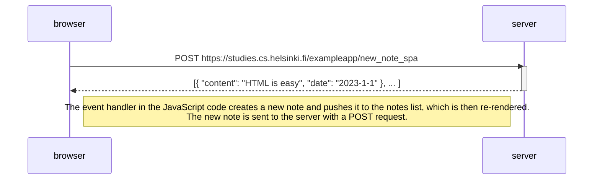

```mermaid
sequenceDiagram
    participant browser
    participant server

    browser->>server: POST https://studies.cs.helsinki.fi/exampleapp/new_note_spa
    activate server
    server-->>browser: [{ "content": "HTML is easy", "date": "2023-1-1" }, ... ]
    deactivate server
    Note right of browser: The event handler in the JavaScript code creates a new note and pushes it to the notes list, which is then re-rendered.<br/>The new note is sent to the server with a POST request.

 
```